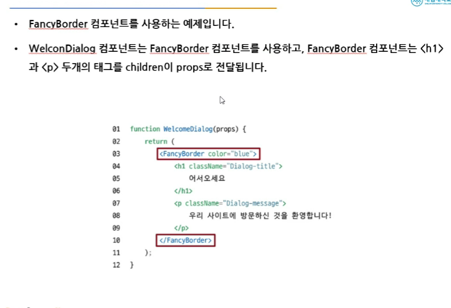
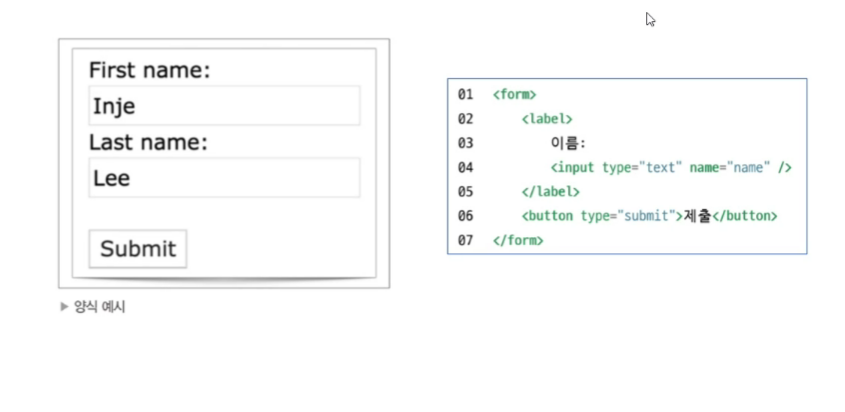
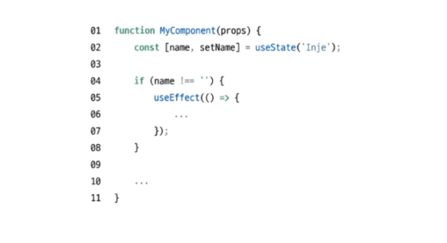
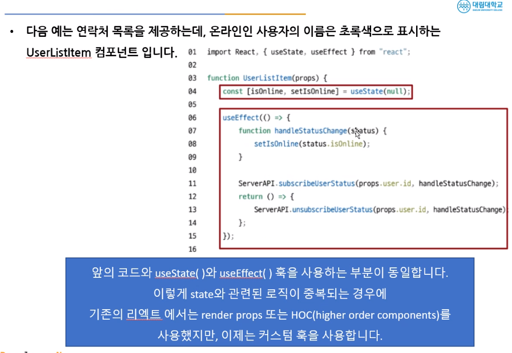
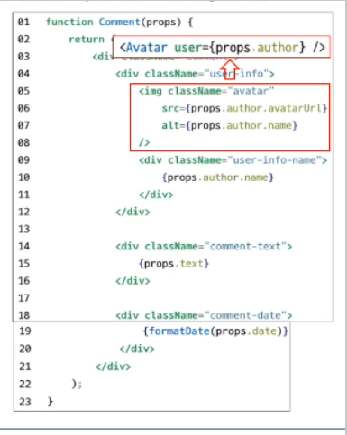

# 정재승 202230233  
<br>

### 참고자료:https://github.com/soaple/first-met-react-practice-v18

## 2024-06-06 Reach 15주차 강의 내용
<br>

## Chapter 15. 스타일링
<br>

### 15.1 css

### 1. css란?
* #### CSS는 Cascading style Sheets의 약자로 스타일링을 위한 언어
* #### Cascading이란 계단식이라는 뜻으로 한 엘리먼트에 여러 스타일이 적용될 경우 스타일간의 충돌을 막기 위해 계단식으로 스타일을 적용시키는 규칙을 갖고 있다
* #### 즉 하나의 스타일이 여러 개의 엘리먼트에 적용될 수도 있고, 하나의 엘리먼트에도 여러 개의 스타일이 적용될 수도 있다.
* #### 엘리먼트에 스타일이 적용되는 규칙을 selector(선택자)라고 한다. CSS는 이 선택자와 스타일로 이루어 진다.
<br>

### 2.CSS 문법과 선택자
* #### 선택자를 먼저 쓰고 다음에 적용할 스타일을 중괄호 안에 세미콜론으로 구분하여 하나씩 작성한다.
* #### 선택자는 HTML 엘리먼트를 직접 넣어도 되고, 엘리먼트의 조합 혹은 class의 형태로 작성 가능하다
* #### 스타일은 property(속성)과 key value(키 값)로 이루어지며, 이들은 콜론(:)으로구분한다
* #### class 선택자. HTML 태그로 특정할 수 없는 스타일은 모드 class로 정의 한다.
```
   <span class="medium">
        ...
    </span>

   <p class="medium">
        ....
    </p>

   .medium{
    font-size: 20px;
    }
   p.medium{
    font-size: 20px;
    }
```
* #### 그룹 선택자.
* #### 상태 선택자.
<br>

### 3.레이아웃과 관련된 속성
* #### 화면에 엘리먼트를 어떻게 배치할 것인지를 정의 한다.
* #### 가장 중요한 속성은 display이다.
* #### 모든 엘리먼트는 기본 display 속성을 갖고 있지만 이 기본값을 변경해 줄 수 있다.
```
    div{
        display: none | block | inline | flex;
    }
```
* #### none는 존재는 하지만 화면에 보이지 않는 것, 자바스크립트를 넣을 때 많이 사용한다.
* #### block은 세로로 정렬되며, with의 heigh를 갖을 수 잇다. 크기와 상관없이 한 줄을 점유한다,.
* #### inline은 가로로 정렬되며, with의 heigh를 갖을 수 없다. 컨텐츠의 크기만큼 공간을 점유한다.
* #### inline-block는 기본적으로 inline의 특성을 갖지만, with와 height 등 block의 특성을 사용할 수 있다.
* #### 대표적인 block과 inline 태그는 다음과 같다.
- ```Block: <div><table><h1>-<h6><p><form><ul>```
* #### visbility 속성은 엘리먼트의 가시성을 정의한다.
``` 
div{
    visiblity: visible | hidden;
}
```
* #### 여기서 중요한 것은 display:none과 visibility:hidden의 차이이다.
* #### display:none은 엘리먼트의 영역이 보이지 않고, visibility:hidden는 차지하는 영역은 보인다.

### 15.2 styled-components
* #### CSS 문법을 그대로 사용하면서 결과물을 스타일링된 컴포넌트 형태로 만들어 주는 오픈소스 라이브러리.

1. #### styled-components 설치 
* ##### npm install styled-components
<br>

2. #### styled-components 기본 사용법
* ##### 태그드 템플릿 리터럴을 사용하여 구성 요소의 스타일을 지정한다.
<br>

3. #### styled-comonents의 props 사용하기 

<br>

4. #### styled-components 확장하기


## 2024-06-05 React 14주차 강의 내용
<br> 

### [2] Specialization(특수화, 전문화)
<br>

* #### 웰컴다이얼로그는 다이얼로그의 특별한 케이스입니다.
<br>

### [3] Containment와 Specialization을 같이 사용하기.
<br>    

* #### Containment를 위해서 props.children을 사용하고, Specialization을 위해 직접 저으이한 props를 사용하면 된다

### 13.2 상속에 대해 알아보기
<br>

### 13.3(실습) Card 컴포넌트 만들기
<br>


----
<br>

## Chapter 14. 컨텍스트
<br>

### 14.1 컨텍스트란 무엇인가?

* #### 기존의 일반적인 리액트에서는 데이터가 컴포넌트의 props를 통해 부모에서 자식으로 단방향으로 전달되었습니다.
* #### 컨텍스트는 리액트 컴포넌트들 사이에서 데이터를 기존의 props를 통해 전달하는 방식 대신 '컴포넌트 트리를 통해 곧바로 컴포넌트에 전달하는 새로운 방식'을 제공한다.
* #### 이 것을 통해 어떤 컴포넌트라도 쉽게 데이터에 접근할 수 있다
* #### 컨텍스트를 사용하면 일일이 props로 전달 할 필요 없이 그림처럼 데이터를 필요로 하는 컴포넌트에 곧바로 데이터를 전달 할 수 있다.
<br>

### 14.2 언제 컨텍스트를 사용해야 할까?

* #### 여러 컴포넌트에서 자주 필요로 하는 데이터는 로그인 여부, 로그인 정보, ui 테마, 현재 선택된 언어 등이 있다.

* #### 반복적인 코드를 계속해서 작성해 주어야 하기 때문에 비효율적이고 가독성이 떨어진다.
* #### 컨텍스트를 사용하면 이러한 방식을 깔끔하게 개선할 수 있다.

* #### 예제에서 처럼 props를 통해 데이터를 전달하는 기존 방식은 실제 데이터를 필요로 하는 컴포넌트까지의 깊이가 깊어질 수록 복잡해진다.

<br>

### 14.4 컨텍스트API
* #### 이 절에서는 리액트에서 제공하는 컨텍스트 API를 통해 컨텍스트를 어떻게 사용하는지에 대해 알아 본다
 ### [1] React.createContext
 * #### 컨텍스트를 생성하기 위한 함수 이다.
 * #### 파라메타에는 기본값을 넣어주면 된다
 <br>

 ### [2] Context.Provider
 * #### Context.Provider 컴포넌트로 하위 컴포넌트들을 감싸주면 모든 하위 컴포넌트들이 해당 컨텍스트의 데이터에 접근할 수 있게된다.

  >   <MyContext.Provider value={/* some value */}>

* #### Provider 컴포넌트에는 value 라는 prop이 있고, 이것은 Provider 컴포넌트 하위에 있는 컴포넌트에게 전달된다.
* #### 하위 컴포넌트를 consumer 컴포넌트라고 부른다.
<br>

### 14.5 여러 개의 컨텍스트 사용하기 
* #### 여러개의 컨텍스트를 동시에 사용하려면 Context.Provider를 중첩해서 사용합니다.
* #### 예제에서는 ThemeContext와 UserContext를 중첩해서 사용하고 있다.
* #### 이런 방법으로 여러 개의 컨텍스트를 동시에 사용할 수 있다.
<br>

### 14.6 useContext
* #### 함수형 컴포넌트에서 컨텍스트를 사용하기 위해 컴포넌트를 매번 Consumer 컴포넌트로 감싸주는 것보다 더 좋은 방법이 있다. 바로 7장에서 배운 Hook이다.
* #### useContext() 혹은 React.createContext() 함수 호출로 생성된 컨텍스트 객체를 인자로 받아서 현재 컨텍스트의 값을 리턴 한다.
> function MyComponent(props){
    const value = useContext(MyContext);
    return(
        ...
    )
}
* #### 이 방법도 가장 가까운 상위 Provider로 부터 컨텍스트의 값을 받아 온다.

<br>

## chapter 12 

### 12.1 Shared State
<br>

* #### Shared state는 공유를 의미한다.
* #### 같은 부모 컴포넌트의 state를 자식 컴포넌트가 공유해서 사용하는 것이다.
* #### 다음 그림은 부모 컴포넌트가 섭씨 온도의 state를 갖고 있고, 이 것을 컴포넌트 C와 컴포넌트F가 공유해서 사용하는 것을 보여 준다.

----
<br>

### 12.2 하위 컴포넌트에서 state 공유하기 
<br>


----
<br>

## Chpater 13 합성 vs 상속
<br>

### 13.1 합성
<br>

* #### 합성은 '여러 개의 컴포넌트를 합쳐서 새로운 컴포넌트를 만드는 것.
* #### 조합 방법에 따라 합성의 사용 기법은 다음과 같이 나눌 수 있다.

### [1]Containment(담다, 포함하다, 격리하다)
> * #### 특정 컴포넌트가 하위 컴포넌트를 포함하는 형태의 합성 방법이다.
> * #### 컴포넌트에 따라서는 어떤 자식 엘리먼트가 들어올 지 미리 예상할 수 없는 경우가 있다
> * #### 범용적인 '박스' 역할을 하는 Sidebar 혹은 Dialog와 같은 컴포넌트에서 특히 자주 볼 수 있다.
> * #### 이런 컴포넌트에서는 children prop을 사용하여 자식 엘리먼트를 출력에 그대로 전달하는 것이 좋다.
> * #### 이때 children prop은 컴포넌트의 props에 기본적으로 들어있는 children속성을 사용합니다.
> * #### 다음과 같이 props.children을 사용하면 해당 컴포넌트의 하위 컴포넌트가 모두 children으로 들어오게 된다.

> * #### children은 다음 구조에서 세 번째 들어가는 파라미터 이다.
> * #### 파라미터가 배열로 되어있는 이유는 여러개의 하위 컴포넌트를 가질 수 있기 때문이다.
<br>




## 2024-05-29 React 13주차 강의 내용
<br>

## chapter 11 태그

### 11.3 textarea 태그 
<br>

* #### HTML에서는 textarea의 children으로 텍스트가 들어가는 형태이다.

### 11.4 select 태그

* #### select 태그도 textarea와 동일하다.

----
<br>

### 11.5 File input 태그
 
* #### File input 태그는 그 값이 읽기 전용이기 때문에 리액트에서는 비제어 컴포넌트가 된다.

----
<br>

### 11.6 여러 개의 입력 다루기

----
<br>

### 11.7 Input Null Value

* #### 제어 컴포넌트에 value prop을 정해진 값으로 넣으면 코드를 수정하지 않는 한 입력값을 바꿀 수 없다.
* #### 만약 value prop은 넣되 자유롭게 입력할 수 있게 만들고 싶다면 값이 UNDEFINED 또는 NULL을 넣어 주면 된다.

----
<br>

### 11.8 (실습) 사용자 정보 입력받기

----
<br>


## 2024-05-22 React 12주차 강의 내용
<br>

## chapter 10 리스트와 키
<br>

### 10.1 리스트와 키란 무엇인가?

* #### 리스트는 자바스크립트의 변수나 객체를 하나의 변수로 묶어 놓은 배열과 같은 것
* #### 키는 각 객체나 아이템을 구분할 수 있는 고유한 값을 의미한다.
* #### 리엑트에서는 배열과 키를 사용하는 반복되는 다수의 엘리먼트를 쉽게 렌더링할 수 있다.
<br>

### 10.2 여러 개의 컴포넌트 렌더링하기
<br>

* #### 예의 에어비엔비의 화면처럼 같은 컴포넌트를 화면에 반복적으로 나타내야 할 경우 배열에 들어 있느느 엘리먼트를 map()함수를 이용하여 랜더링 한다.
<br>


----
<br>

* ####  다음은 numbers 배열에 들어있는 각각의 요소를 map()를 이용하여 하나씩 추출하여, 2를 곱한 후 doubled라는 배열에 다시 넣는 코드이다.

<br>

* ####  다음은 리액트에서 map()함수를 사용한 예제이다.

<br>

* #### 이 코드는 numbers의 요소에 2를 곱하는 대신 <li>태그를 결합해서 리턴하고 잇다.
* #### 리턴된 listitems는 <ul>태그와 결합하여 렌더링 된다.

<br>

### 10.3 기본적인 리스트 컴포넌트
<br>

* #### 앞서 작성한 코드를 별도의 컴포넌트로 분리하면 다음과 같다.
* #### 이 컴포넌트는 props로 받은 숫자를 numbers로 받아 리스트로 렌더링 해 준다.


* #### 이 코드를 실행하면 "리스트 아이템에 무조건 키가 있어야 한다" 는 경고 문구가 나온다.
* #### 경고 문구가 나오는 이유는 각각의 아이템에 key props가 없기 때문.
<br>

### 10.4 리스트의 키에 대해 알아보기
<br>
 
* #### 리스트에서의 키는 "리스트 에서 아이템을 구별하기 위한 고유한 문자열" 입니다.
* #### 이 키는 리스트에서 어떤 아이템이 변경, 추가 또는 제거되었는지 구분하기 위해 사용한다.
* #### 키는 같은 리스트에 있는 엘리언트 사이에서만 고유한 값이면 된다.

<br>


## Chapter 11 폼

### 11.1 폼이란 무엇인가?
<br>

* #### 폼은 일반적으로 사용자로부터 입력을 받기 위한 양식에서 많이 사용된다.

<br>

### 11.2 제어 컴포넌트
<br>

* #### 제어 컴포넌트는 사용자가 입력한 값에 접근하고 제어할 수 있도록 해주는 컴포넌트입니다.

<br>

* #### 다음 코드는 사용자의 이름을 입력 받는 HTML폼을 리액트 제어 컴포넌트로 만든 것이다.


## 2024-05-01 React 5주차 강의 내용
<br>

## chapter 7 훅

### 7.7훅의 규칙

* #### 첫 번째 규칙은 무조건 최상위 레벨에서만 호출해야 한다는 것이다.
* #### 따라서 반복문이나 조건문 또는 중첩된 함수들 안에서 훅을 호출하면 안된다.
* #### 이 규첵에 따라 훅은 컴포넌트가 랜더링 될 때 마다 같은 순서로 호출 되어야 한다.
* #### 다음 코드는 잘못된 코드의 예이다.


-----
<br>

* #### 두번째 규칙은 함수형 컴포넌트에서만 훅을 호출해야 한다.
* #### 따라서 일반 자바스크립트 함수에서 훅을 호출할 수 없다.
* #### 훅은 함수형 컴포넌트 혹은 직접 만든 커스텀 훅에서만 호출 할 수 있다.
<br>

### 7.8 나만의 훅 만들기 
<br>

* #### 필요 하다면 직접 훅을 만들어 쓸 수도 있다. 이것을 커스텀 훅이라고 한다.
1. #### 커스텀 훅을 만들어야 하는 상황
#### 예제 UserStatus 컴포넌트는 isOnline 이라는 state에 따라서 사용자의 상태가 온라인인지 아닌지를 텍스트로 보여주는 컴포넌트이다.

-----
<br>


<br>
-----
<br>

2. #### 커스텀 훅 추출

-----
<br>

3. #### 커스텀 훅 사용하기


### 7.9훅을 사용한 컴포넌트 개발(실습)
<br>

### 8.1이벤트 처리하기
<br>

* #### Dom 에서 클릭 이벤트를 처리하는 예제 코드

<br>

* #### React에서 클릭 이벤트 처리하는 예제 코드

<br>

* #### 둘의 차이점은 
1) #### 이벤트 이름이 onclick에서 onClick으로 변경.(Camel case)
2) #### 전달하려는 함수는 문자열에서 함수 그대로 전달.
<br>

* #### 이벤트가 발생했을 때 해당 이벤트를 처리하는 함수를 "이벤트 핸들러(EventHandler)"라고 합니다.또는 이벤트가 발생하는 것을 계속 듣고 있다는 의미로 "이벤트 리스너 라고 부르기도 한다.
<br>


## 2024-04-03 React 5주차 강의 내용
<br>

## chapter 5.컴포넌트와 Props
<br>

### 5.1 컴포넌트에 대해 알아보기 
<br>

* #### 리엑트는 컴포넌트 기반의 구조
* #### 컴포넌트 구조는 작은 컴포넌트가 모여 큰 컴포넌트를 구성, 이런 컴포넌트들이 모여 전체 페이지를 구성한다는 것을 의미
* #### 입력은 Props가 담당하고 출력은 리엑트 엘리먼트의 형태로 출력
* #### 엘리먼트를 필요한 만큼 만들어 사용한다는 면에서는 객체 지향과 개념이 비슷함
<br>

### 5.2 Props에 대해 알아보기
---
<br>

1. ### Props의 개념 
* #### props는 prop(property: 속성, 특성)의 준말
* #### 이 props가 바로 컴포넌트의 속성이다.
* #### 컴포넌트에 어떤 속성, props를 넣느냐에 따라 속성이 다른 엘리먼트가 출력된다.
* #### props는 컴포넌트에 전달 할 다양한 정보를 담고 있는 자바스크립트 객체이다.

---
<br>

2. ### Props의 특징
* #### 읽기 전용. 변경할 수 없다.
* #### 속성이 다른 엘리먼트를 생성하려면 새로운 props를 컴포넌트에 전달하면 된다.
---
<br>

### Pure 함수 vs. Impure 함수
* #### Pure함수는 인수로 받은 정보가 함수 내부에서도 변하지 않는 함수
* #### Impure함수는 인수로 받은 정보가 함수 내부에서 변하는 함수

---
<br>

3. ### Props 사용법
* #### JSX에서는 key-value쌍으로 props를 구성

---
<br>

#### 위의 코드는
> 1. #### App 컴포넌트에서 props를 인자로 받아,
> 2. #### 내부의 Profile 컴포넌트로 전달해서 name, introduction, viewCount에 각각 속성을 할다하는,
> 3. #### 이때 전달되는 Props는 다음과 같은 자바스크립트 객체이다.

---
<br>

* #### JSX에서는 중괄호를 사용하면 JS코드를 넣을 수있다고 배웠따.
* #### 다음 코드처럼 props를 통해서 value를 할당 할 수 있고, 직접 중괄호를 사용하여 할당할 수도 있다.

---
<br>

* #### JSX를 사용하지 않는 경우 props의 전달 방법은 createElement()함수를 사용하는 것이다.

---
* #### createElement()함수의 두번째 매개변수가 바로 props이다.
* #### JSX를 사용하지 않으면 다음과 같이 코드를 작성할 수 있다.

---
<br>


### 5.3 컴포넌트 만들기
---
<br>

1. ### 컴포넌트의 종류

2. ### 함수형 컴포넌트 
* #### Welcome컴포넌트는 props를 받아, 받은 props중 name키의 값을 "안녕,"뒤에 넣어 반환합니다.

<br>

4. ### 컴포넌트 이름 짓기
* #### 이름은 항상 대문자로 시작
* #### 리액트는 소문자로 시작하는 컴포넌트를 DOM 태그로 인식하기 때문html tag
* #### 컴포넌트 파일 이름과 컴포넌트 이름은 같게 합니다.
<br>

5. ### 컴포넌트의 렌더링
* #### 랜더링의 과정은 다음 코드와 같다.

<br>

### * 실습 *
Welcome.jsx 생성

---
<br>


### 5.4 컴포넌트 합성
<br>

* #### 멐포넌트 합성은 여러개의 컴포넌트를 합쳐서 하나의 컴포넌트를 만드는 것이다.
* #### 리액트에서는 컴포넌트 안에 또다른 컴포넌트를 사용할 수 있기 때문에, 복잡한 화면을 여러개의 컴포넌트로 나누어 구현 할 수 있다.
* #### 다음 코드에서는 props의 값을 다르게 해서 Welcome 컴포넌트를 여러번 사용한다.

---
<br>


### 5.5 컴포넌트 추출
---
<br>

* #### 복잡한 컴포넌트를 쪼개서 여러개의 컴포넌트로 나눌 수 있다.
* #### 큰 컴포넌트에서 일부를 추출해서 새로운 컴포넌트를 만드는 것이다.
* #### 실무에서는 처음부터 1개의 컴포넌트에 하나의 기능만 사용하도록 설계하는 것이 좋습니다.

* #### Comment는 댓글 표시 검포넌트이다.
* #### 내부에는 이미지, 이름 ,댓글과 작성일이 포함되어있다.
* #### 첫번째로 이미지 부분을 Avatar 컴포넌트로 출력해 보았다.


---
<br>

* #### 두번 째로 사용자 정보 부분을 추출한다.
* #### 컴포넌트 이름은 UserInfo로 한다. React 컴포넌트 이름은 Camel notatio을 사용한다
* #### UserInfo 안에 Avatar 컴포넌트를 넣어서 완성시킨다.

---
<br>

* #### 추출 후 다시 결합한 UserInfo를 Comment 컴포넌트 반영하면 다음과 같은 모습이 된다.
* #### 처음에 비해서 가독성이 높아진 것을 확인할 수 있다.

<br>


### 5.6 댓글 컴포넌트 만들기
<br>

#### Comment.jsx
```
const styles = {
    wrapper: {
        margin: 8,
        padding: 8,
        display: "flex",
        flexDirection: "row",
        border: "1px solid grey",
        borderRadius: 16,
    },
    imageContainer: {},
    image: {
        width: 50,
        height: 50,
        borderRadius: 25,
    },
    contentContainer: {
        marginLeft: 8,
        display: "flex",
        flexDirection: "column",
        justifyContent: "center",
    },
    nameText: {
        color: "black",
        fontSize: 16,
        fontWeight: "bold",
    },
    commentText: {
        color: "black",
        fontSize: 16,
    },
};

export default function Comment (props) {
    return ( <div style = {styles.wrapper}>
        <div style={StyleSheet.imageContainer}>
            <img
            src = "data:image/png;base64,iVBORw0KGgoAAAANSUhEUgAAAMwAAADACAMAAAB/Pny7AAAAaVBMVEX///8AAAD8/Pzw8PDt7e309PTq6ur4+Pjh4eHX19fl5eXb29tpaWnT09NTU1MLCwtzc3OampqNjY2zs7NJSUm6urrFxcUdHR0pKSk5OTmmpqZYWFh7e3tjY2MvLy+UlJQUFBRBQUGDg4NyeazsAAANfklEQVR4nO1d16KqOhBVeu+ggAX8/4+86t2ZJEiZiaDnwfV2zjakTaZnstv98MMPP/zwww8//DAKzdQtz/N9N6zKPC+r0PV9z7N0U/v2yGiwLT8s8yyJLvsBLlGQNWXoe+a3x4iC6VT5NSm64TREdH1wbSr/H5+QUTXZ+Tg3D45DmzWV9e0RT8Eos6THTYShDrLS+Pa4X6FVt3NNm8n/uLS36t9iCXbzetYJ8ynSf+f46MkhVp/KA/Eh+TdOT3heGChg/net++2Z2FNT6Y5139/5VV75nmFqmml4fpXfeV3R18cJvn0O7S9OxQyTsUEd+zZJK2eqlVOlSVuMMvAk/NrhCbPD63iKIMvdxSGZfp4FxWvrOAs/MfIXeM0rKy5uTahjP2CGze11PnXjbTnqUWhlMBzG4dRQid4Om9MLvQXlh+WOkw3HEDWhkiw3wiYafOqYTZ63LVAN+29LS3k5NasassSoXHO0s7CHB79dPvHzMN3BdA7Zh7i0N9iWYhUGFA54QfQRPlANplKt9uHBdFb78CTsRuqwTlckB3vA7JuNSc04ib0dbyuzHecmMcnTpraOIwmX8/oCQSslThBsyKPDVuzpuskR9a5iH+1m2o3EcIqt5LRWSt1sNJuqFzpJNrQ+XFEX7zdhaqFoGGebHk1DJLXLBnvjCBbVIV//+zJyQcfo/LW/bglrVW8vznaVKHJW9g+Ywqej1VdqDL6oNK1qf5rCOrUfMp48QQ7UK85GF2TlGW1Jvt2rID+D1Xo1b8JcPujfsoTZ3Nbam4azluCjBrrHKeLQrPNJgbFsqSuNQdAF12GhAlv5vNPR5VxgDSaq31ZeHBoEHer2PhMo4WPHzeX+GARd4G0vh88ZSrrG2OhI+QjepHKB15+UVH7bNCzPd13fswxTyQzWuHH7pozjFn9LFzC251dpAIbwMUgr36NPyOJM4C3+7HA+T1bEvSqVDNO/NUkrsqgK+bF5RzSor4nbJBNRmC5oqLTP6eNMbCmAu8gCWkMnHfpvJUQpUWZw2aksHcweVpNEGmYzQl+D6TQkXcuDXe5VdTRuvJIkjBvMpmf8LU9AorUcGioKCAs2hsQSc2SGxpEiA3XY60LN+8D1GAKF2xluKg9QPP0utLrRZ3KX/eC+IviTzUE8rTvWyTWvXPeRHfQSZg7wB8AGRaBQUThhiXt8a11yrsZ9IAcovSbopWyAM342fg8bip8DgwvMtUHrMfJcomzkjPtXiWnjzWENhE1EV9GgbYveGFMMEfTphLR20l742Qm9Nz7jATFZqXHYIsd4Xij6IU8z6k8oTvqK/nzKKPRMVWpK1rJFtxR5cjPLQHUhYoW3khzYGqJhYzC+HKNXjh+y/WGxt5LrjvgjACzpRpM1IWOiPbYrkwuYC0KBqrgbPsMeG5cdto6kwnPWccI24eZ1h6KCksscNNVAqAPPYO/w2BocsWsADGMfIw9BDhLnjFVjIarSUxTfEAga24JrguhDpqDHwrEk0JkG/WBZugcbE6DNa+59RW8NUP8VT2c6284YK6DBjMMcfmgEvBzbSGekWeP1eKCyFtmAy340w3gADjRaDwBLAE9noKFi+YzHVuxAEs4+kzYdljaBZ+L1EpABWMqEPhJ0H0/A1mBXTQNyxnahU6lMAyuGqNCCyRVglw3oDEuYsM5YlgnrdUQ2AAALwE4G+Bl2L2HzsZQMDmmySQumOdbO8KgEzX5fYJcrpw4JAMuAJgIw5nG/h5D/DTsZYMxkpxaE5LEsXYO9xGnOIADRCmD/16DGNuBgIcYe2wAONE7Qgi6DJhomLhQ8wUylOWAbAGHidEDGZy9oLYt9X8FvAlSDbWAxBohzfzOiwXtO2IAUwicpdTKQYIEiTJPJ/yvW9wdiRiHoCYwQy2xsdgouGG7js33Euw3e2BkQgugWjAMcMUcafA14xZR2JiVcyZNhKv2y1+SOpiNPhunMJP3/fzBtI0a3YJPpMHSQ/Q3tghfnYJqjWwAYt0FrwTv/r7cYwzvZWqFtWc7MO3J0XWNkgI8zgoWO0c7gt/hYOfBXcjAYwtl4Y8uC1Ub8mFkMhNx1MLPJvBk4M/6AQgY/xtpik0E7GgVrDu2ZYgDfEd5BAa5TxGQ09n1CvEyDjDSi2gxKc40/bRBDi5bb2GwyFBcoHBpiLFilHbiOo+XV1guFyYAqSzQCYEcJVh1MplgmTYtNhnKYYQVoUa0mxo+LgzGNYpndeiqT0YAr9YTQCU80yCkCCiazLAiVdmbnAMEQfBpgy9Qk+UTYGaUzI4Tpa7SyXYKvkXRxjZ+Z5ckocbPdzoWtwWa58qzcmuQ6hCt80bIcUJEzO3FrkIncQgK2Yk8IOaOiATzg8LSsBMEEhGuF+Hj2EzpBA1DRzZ4QIufBYlM9gCAgNcOYpJspaM1PaML1h6VkHV+4I4d2Nf6BpDWz35LvyejCCOcvcglZADR5+QDcq8HYtczSRDkMJPhi2lw7OUhdTHo8kk0g1gvK0lTwATCE0tX6bKxEgGZJ2XX0DGOaD0DBOwOopNl0WWiJ1cw00wozKX/uoJAMS/LOOIxYSArTH8pBkZA+y0PXsQzDctwwz3r5r3htgQPUQBSB0j2aIl4KUjwKtCWn00jhtn2kkqQMSaAoj+aOMSW1S2v+aF2dMSRKt3vA11ygfs5+fVS7K6eP1KMZQd2oXbkgRgHAY6p2XSW8oRKbjye1THgIUOMsbXAcKRxPuylqZHmw+FKo1KyAyBmO2YLjiKpo7MyMVugsPhC1WfFqEFJ1ZMKipi2ccZsY8yxOtJNpM6aIjRvC5CnsxrpOjHYRV8p0yCkHEG7Gu1qMsh8b5+HSR217DpIgOLdt1F9GaojdJSuhYiMEp7DsA/yMOFZ+RzUiXC5t8ihmatn28+hptm2FZZMl7UgpxATN2UAzRx+BntZCb16YcX1KS3+0te2X6emlrNkRKXVs2E3sXIjZNlIC+XNkp3y+ZJse5qfh/sylqHMAY8afADhlGK9+PljmAlXozAibYTuM+QyaH+HmCFNI4sVh2al8pvsSexPT9gZM47AsQw2FHE0N7Z2Xazftu5IkBM1Svh20mBbPx0WQ56DRLPAzQ+ZihATdP2ip9IGlPGKgTIrhCDdwj7M805OuMKpVpLCkC0TzXhTIHSbdTeZ3AeZCuo54hGsVw/TZVy6aDMWc/ah2F2DnsmPdT2+oWE4vfqd2kxsI6ulM+bywZ/RC64zXZ5h06AiXwffx9a3aTdZVmM00tYJfh6prA5+Zuqsjnv2DKokxaGJtpilXNdw2wt1pEcCd9OPc2Rb0/TXqXAmXgybsKM746PViIN44Hm9pOGHU65Se5Gxg3L0HG0O/DSiEKMZYB496EUNF0+Dhqv1lhI44gyWGQJ64zoxWqEWz1lyk2YzcDeV/Vchq2zkw4BdvoFC8ac26cAKlvZRmgmzGfaRUeoJ7uIcD5neyVJzF0xBc1UMVGhQslRTdnRhviWRmyXcc5YknACIQQ+o1gEzI8Rz2aVgNacycK8dr1+61M2CSN+nTE0OhfBqWIxYPJC8Tsn4ROkF1FQnYhzkisn8mwAlVMDltoD6FSNFyl3BsCmHYnHm+0SVXWbge8HZtjnlwAycf+T/iNTAJvOAkZ1uwdP0m9Vq1Hrpk/yUwubeK+PEby0w150dxowqUvG7X31n3uNn0XlEwkxPa3x03YJ4KGdk4gFuhe/6T387bJ29WOfS4f+8prfjGbFaCEqIQ/28Nl93Ht5knJ7RnwUSgaIp/hAau6z/cls2KlefEogV1yc8i+s6rAixGyneuI4SvryuU0uQ3/fcFf9VkzULtQ/B0r0Sod00uAzIKoY5my04Q0aVAhAvd8IVcq1TkSCmpFcpAzkB/jcGtVipSuw4jldRiKVSULx3SnaVTsIfPs+CrBKnBH1Z7C9Y8or387a2f7RgWFlO4ZTQH6dvd9jXO5fDAyl83xTDM1lQ2oLNu9VepHMFLd9z6yQ5bjJLS8tFxcEWf/23TItSeyJqVKs0tQnp94rxhuWPp1aNiI/EsvQvS02IkeGiNyDq3exnEkaJct03235ek/zoK2TjkGGa0/uZo8jth277lKEuzQ7Dy5viBnEy89ZNapdjbvlPKSp2AfZVF5QfKkLtyj4d8pelI0bM74o+UutcHhXL7agUJbUpP9TwK7X7ooV07HeTHFpX3FivQrGE69GVLS3aAKhgYHFGu/qS07eeDqcTBR18gsNJhilWflUoqjldeh9lnl/TDr+tq1TDL7M6or9TTY1bX4MUmP33hHWdjeInhjjrJKvTBNaqxF7gpCZtrwmlG8kfrKEmXn8XVwzSJRtLsD1Pld7eH5rzQ2gPdpY5upT9BLJpf3qL6MloH/eR89aVwZ/JSRhx3fZI2ZehYum3rlhOWTZr03fRj1MnXdgXgJcgK7fM4nj7/KvAYzKwfTb7G41Bs+6QdCXYeFMpvtz9KoX/zXfAR3NlTrzKV+7n6ziPa89CrsReyZ1Hcmupj76ZRobtl+irSx3EM0hL/lvh3YHtu1ZyKWY7QFaemchXe1fkGNN3ywjI9tS8yvm6TtKw8S/+qcFSAZtumaRie74ZVFYa+YRim+XcB5Ycffvjhhx9++GEt/AeMaKo8m9JweQAAAABJRU5ErkJggg=="
            style = {styles.image}
            /> 
            </div>

            <div style={styles.contentContainer}>
                <span style ={styles.nameText}>{props.name}</span>
                <span style={styles.commentText}>{props.comment}</span>
            </div>
        </div>
    

       ) 
    };
        
```
#### CommentList.jsx
```
import Comment from "./Comment";

export default function CommentList (props){
    return(
        <div>
            <Comment name = "홍길동" comment="안녕하세요"/>
            <Comment name = "홍길동" comment="안녕하세요!"/>
            <Comment name = "홍길동" comment="안녕하세요!!"/>
        </div>
    )
}

```
#### index.js
```
import React from 'react';
import ReactDOM from 'react-dom/client';
import './index.css';
import App from './App';
import reportWebVitals from './reportWebVitals';
// import Hello from './Hello'

import Clock from './chapter04/Clock';
import Library from './chapter03/Library';
import Welcome from './chapter05/Welcome';
import CommentList from './chapter05/CommentList'
import Comment from './chapter05/Comment'

const root = ReactDOM.createRoot(document.getElementById('root'));


root.render(  
  <React.StrictMode>
      <CommentList />
   </React.StrictMode>
  ); 
  ```
  <br>

## Chapter 6. state의 생명주기
---
<br>

### 6.1 state
1. #### State란?
* #### state는 리액트 컴포넌트의 상태를 의미한다
* #### 상ㅌ애ㅢ 의미는 정상인지 비정상인지가 아니라 컴포넌트의 데이터를 의미
* #### 정확히는 컴포넌트의 변경가능한 데이터를 의미한다.
* #### State가 변하면 다시 렌더링이 되기 때문에 랜더링과 관련된 값만 state에 포합시켜야 한다.

2. #### state의 특징
* #### 리액트 만의 특별한 형태가 아닌 단지 자바스크립트 객체일 뿐이다.
* #### 예의 LikeButton은 class 컴포넌트이다. 
* #### constructor는 생성자이고 그 안에 있는 this.state가 현 컴포넌트의 state이다.

---
<br>

* #### state는 변경은 가능하다고 했지만 직접 수정해서는 안된다.
* #### 불가능 하다고 생각하는 것이 좋다.
* #### state를 변경하고자 할 때는 setstate()함수를 사용한다.

---
<br>


---
<br>

### 6.2 생명주기에 대해 알아보기
<br>

* #### 생명주기는 컴포넌트의 생성 시점, 사용 시점, 종료 시점을 나타내는 것이다.
* #### constructor가 실행 되면서 컴포넌트가 생성된다.
* #### 생성 직후 componentDidMount() 함수가 호출된다.
* #### 컴포넌트가 소멸 하기 전까지 여러 번 랜더링 한다.
* #### 랜더링은 props setState(), forceUpdate()에 의해 상태가 변경되면 이루어진다.
* #### 그리고 랜더링이 끝나면 componentDidUpdate() 함수가 호출되낟.
* #### 마지막으로 컴포넌트가 언마운트 되면 compomentWillUnMount() 함수가 호출된다.

---
<br>


## 2024-03-27 React 4주차 강의 내용
<br>


## chapter 3. JSX 소개
<br>

### 3.1 JSX(JavaScript XML)란?
----
* #### javascript에 XML을 추가한 확장 문법.
<br>

### 3.2 JSX의 역할
----
<br>

* #### JSX느 내부적으로 XML/HTML 코드를 자바스크립트로 변환.
* #### REACTrk createElement함수를 사용하여 자동으로 자바스크립트로 변환.
* #### 만일 JS작업할 경우 직접 createElement함수를 사용해야 합니다.
* #### JSX는 가독성을 높여 주는 역할
<br>

### 3.3 JSX의 장점
----
<br>

### 3.4 JSX 사용법
----
<br>

* #### 모든 자바스크립트 문법을 지원
* #### 자바스크립트 문법에 XML과 HTML을 섞어서 사용
* #### 만일 HTML이나 xml에 자바스크립트 코드를 사용하고 싶으면 {}괄호를 사용합니다.
<br>
    
    const element = <h1>안녕,[name]</h1>

<br>

### 3.5 JSX 실습
----
<br>
Book.jsx 

    import React from "react";

    export default function Book(props){
        return(
            <div>
                <h1>{`이 책의 이름은 ${props.name}입니다.`}</h1>
                <h2>{`이 책은 총 ${props.numOfPage}페이지로 미뤄져 있습니다.`}</h2>
            </div>
        );
    }
<br>
Library.jsx 

    import React from "react";
    import Book  from "./Book";

    export default function Library(props){
        return(
            <div>
            <Book name="처음 만난 파이썬" numOfPage={300}/>
            <Book name="처음 만난 AWS" numOfPage={400}/>
            <Book name="처음 만난 리액트" numOfPage={500}/>
            </div>
        )
    }
<br>


<br>

### jsx 사용하지 않았을 때 Book 컴포넌트
.png)

#### "import Library from `./chapter03/Library`;" 입력후
#### 기존에 있던 App 을 Library 로 수정
<br>


<br>

## Chapter 04.엘리먼트

<br>

### 4.1 엘리먼트에 대해 알아보기
----

### 1.엘리먼트의 정의
* #### 엘리먼트는 리액트 앱을 구성하는 요소를 의미
* #### 공식페이지에는 "엘리먼트는 리액트 앱의 가장 작은 빌딩 블록들"이라고 설명하고 있다.
* #### 웹사이트의 경우는 DOM 엘리먼트이며 HTML요소를 의미

### 리액트 엘리먼트와 DOM엘리먼트의 차이
* #### 리액트 엘리먼트는 Virtual DOM의 형태를 취함
* #### DOM 엘리먼트는 페이지의 모든 정보를 갖고 있어 무겁다.
* #### 리액트 엘리먼트는 변화한 부분만 갖고 있어 가볍다.
<br>


<br>
<br>

<!-- ### 2.엘리먼트의 생김새 
* #### 리액트 엘리먼트는 자바스크립트 객체의 형태로 존재 -->
### 3.엘리먼트의 특징
* #### 불변성 - 한 번 생성된 엘리먼트의 children이나 속성(attributes)을 바꿀수 없습니다.

#### 내용이 바뀐다면?
* #### 컴포넌트를 통해 새로운 엘리먼트를 생성하면 된다.
* #### 그 다음 이전 엘리먼트와 교체를 하는 방법으로 내용을 바꾸는 것
* #### 이렇게 교체하는 작업을 하기위해 Virtual DOM을 사용한다.
<br>

### 4.2 엘리먼트 렌더링하기
----
<br>

#### Root DOM node 
#### id값이 root인 div태그로 단순하지만 리액트에 필수로 들어가는 중요한 코드다.
#### 이 div 태그 안에 리액트 엘리먼트가 렌더링 되며, 이것을 Root DOM node라고 한다.

    <div id="root"></div>

#### 엘리먼트를 렌더링 하기 위해서는 다음과 같은 코드가 필요하다.

    const element = <h1>안녕, 리엑트!<h1>;
    ReactDOM.render(element,document.getElementById('root'));

#### 이때 render() 함수를 사용하게 된다.
#### 이 함수의 첫 번째 파라메타 출력할 리액트 엘리먼트이고, 두번째 파라메터는 출력할 타겟을 나타낸다.
#### 즉 리엑트 렌더링의 과정은 Virtual DOM에서 실제 DOM으로 이동하는 과정이라고 할 수 있다.
<br>

### 4.3 렌더링된 엘리먼트 업데이트 하기
---
<br>

* #### 다음 코드는 tick() 함수를 정의하고 있다. 
* #### 이 함수는 현재 시간을 포함한 element를 생성해서 root div에 렌더링해 준다.
* #### 그런데 


## 2024-03-20 React 3주차 강의 내용  
<br>

## Chapter 1. 리액트 

### 1.1 리액트는 무엇인가?
----
<br>

#### -웹 및 앱 유저 인터페이스를 위한 라이브러리-  
#### -The Library for Web and Native User Interfaces.-
>##### (공식 사이트: react.dev)
<br>

* #### 복잡한 사이트를 쉽고 빠르게 만들고, 관리하기위해 만들어진 것.
* #### 다른 표현으로는 SPA를 쉽고 빠르게 만들 수 있도록 해주는 도구.  
<br>

### 1.2 리액트의 장점  
----
<br>

#### 1.빠른 업데이트와 랜더린 속도  
> * ##### Virtual DOM
> * ##### DOM(Document Object Model)이란 XML, HTML문서의 각 항목을 계층으로 표현하여 생성, 변형, 삭제할 수 있도록 돕는 인터페이스. (W3C의 표준)
> * ##### Virtual DOM은 DOM 조작이 비효율적인 이유로 속도가 느려 고안된 방법.  
> * ##### DOM - 동기식, Virtual DOM - 비동기식 -방법으로 랜더링 (동기식은 일부분이 바껴도 전체적으로 바꿈, 비동기식은 일부분만 바꿈.)
<br>

#### 2.컴포넌트 기반 구조  
> * ##### 리액트의 모든 페이지는 컴포넌트로 구성됨.
> * ##### 하나의 컴포넌트는 다른 여러개의 컴포넌트와의 조합으로 구성 가능.
> * ##### 리엑트로 개발 -> 레고 블록을 조립하는 듯한 방식으로 웹사이트 개발.
<br>

#### 3.재사용성  
> * ##### 반복적인 작업을 줄여 생산성을 높여줌.
> * ##### 유지보수
> * ##### 재사용이 가능할려면 의존성이 없어야함.  

<br>

#### 4.든든한 지원군
> * ##### 메타에서 오픈소스 프로젝트로 관리하고 있어 계속 발전하고 있음.
<br> 

#### 5.활발한 지식 공유 & 커뮤니티
<br>

#### 6.모바일 앱 개발가능
> * ##### 리액트 네이티브라는 모바일 환경 UI 프레임워크를 사용하면 크로스 플랫폼 모방일 앱을 개발 할 수 있음  
<br>

### 1.3 리액트의 단점
<br>

#### 1. 높은 상태 관리 복잡도
<br>  

## Chapter 2. 리액트 시작하기  
<br>

### 2.1 Create-react-app으로 만들기
<br>


<br>

#### 위에 사진 치고 .gitignore에서 터미널 열고 npm start   
<br>


---------

## 3주차 총정리  
<br>

> * #### 리액트가 무엇인지, 장단점, 프로젝트 만들기  
<br>


## 2024-03-13 React 2주차 강의 내용
<br>

### GitHub 사용법     
<br>

## git config user.name  
## git config user.email  

